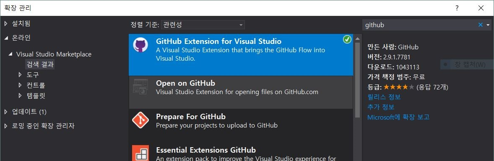
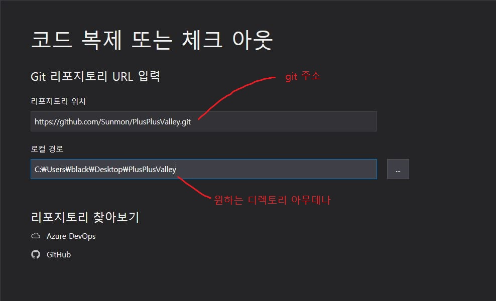
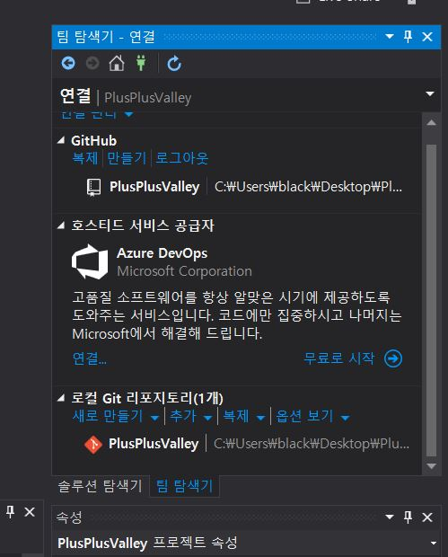
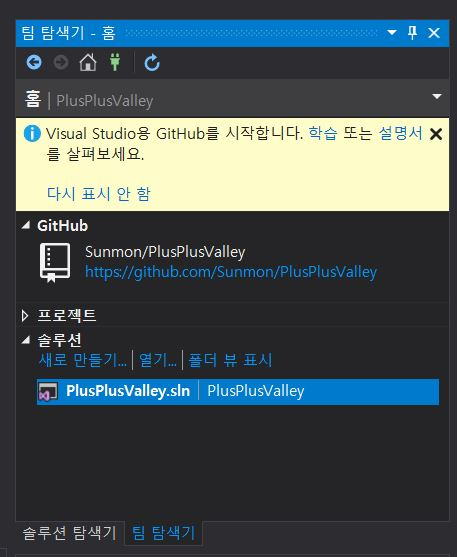
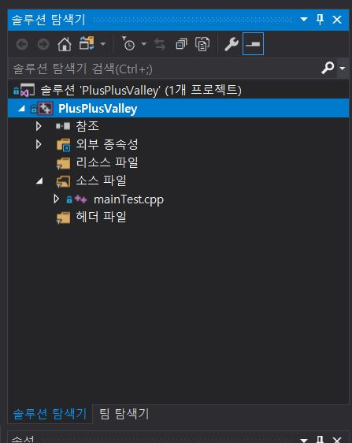
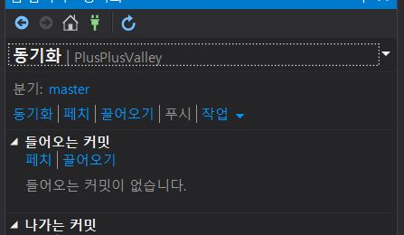

# Plus Plus Valley

2019-1학기 전공기초프로젝트2 팀 프로젝트

방학기념 다시 만드는 프로젝트 주소:

https://github.com/Sunmon/mini-Valley

(여행가서 8월 중 완성 예정)

## GIT

### 연동하기

#### 0. Git 확장프로그램 설치(선택)

비주얼 스튜디오 실행 - 확장(맨위)- 확장 관리- github 검색 후 `github extension for visual studio`설치

 
 

#### 1. 로컬 저장소 연결하기 (vs2019 기준)

코드 복제 또는 체크 아웃 - 리포지토리 위치 입력 (https://github.com/Sunmon/PlusPlusValley.git) - 로컬 디렉토리 입력(원하는 곳 아무데나)

 

팀 탐색기 - PlusPlusValley 더블클릭(빨간 아이콘)

 

솔루션 - PlusPlusValley.sln 더블클릭

 

 

#### 2. 코드 작성하기

'팀 탐색기' 대신 '솔루션 탐색기'로 변경

익숙한 화면이 보임

평소 하던 것처럼 코드를 작성하면 된다.

 

 

### PULL

`팀 탐색기`(화면 우측) - `홈` 클릭 - `동기화` - `끌어오기`

원격 저장소의 내용이 내 컴퓨터의 로컬 저장소로 동기화된다.

즉, 다른 사람이 작성한 코드를 내 컴퓨터로 받아온다는 뜻.

 

### COMMIT

`팀 탐색기`(화면 우측) - `변경 내용`

변경한 내용에 대한 설명(노란색 박스)를 쓰고 - `모두 커밋`

 

### PUSH

`팀 탐색기` - `동기화` - 나가는 커밋 - `푸시`

내 로컬 저장소에 변경된 내용을 원격 저장소로 업로드하고,

다른 사람들이 해당 내용을 볼 수 있게 한다.

 

 

### Branch

링크로 대체 : https://backlog.com/git-tutorial/kr/stepup/stepup1_1.html

 

 

### 오류 뜬 경우(conflict)

아직 오류 안 떠서 설명 불가

오류 뜨면 설명 추가 예정

 

 

## 폴더 설명

`./PlusPlusValley`

메인 솔루션 폴더.

이 폴더에 소스들을 모아놓고 빌드한다.

`./etc`

그냥 기타 파일들.  readme에 쓸 이미지 등..

## Intro

## Docs

프로젝트에 필요한 문서들을 저장하는 폴더.

각종 다이어그램, 기획 문서, ppt 등

## Game
